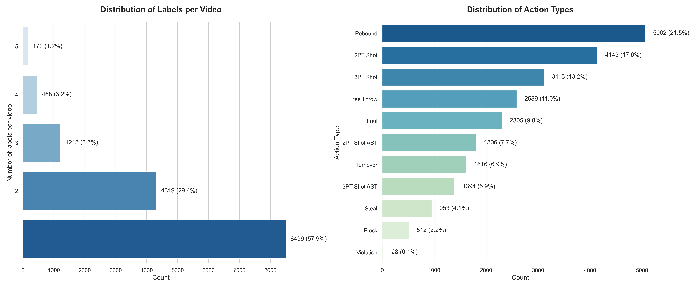

# 🏀👁️ BARD: A Basketball Action Recognition Dataset for multi-label classification 👁️🏀

📄 **Paper**: [Link to the paper](https://www.sciencedirect.com/science/article/pii/S1077314226000809)
📑 **Journal**: *Computer Vision and Image Understanding (2026)*

## 🔍 Abstract

We present the BARD dataset (Basketball Action Recognition Dataset). It is designed to advance video action recognition in basketball through high-quality annotations and enriched contextual data.
BARD improves upon existing datasets by including player jersey numbers, team colors and a novel output format supporting multi-label classification. To ensure annotation quality, we conducted a human validation study on a subsample of the annotations, with expert reviewers assessing the labeling quality and reporting the evaluation results, thereby providing human validated independent benchmarks. 
Moreover, in addition to standard caption-based action recognition metrics, we introduce Basketball Caption Evaluation Framework (BaCEF), a new application-oriented evaluation framework. Finally, to demonstrate the quality and challenging nature of the dataset, as well as the utility of our evaluation framework and its potential applications, we evaluate both proprietary models (e.g., Gemini 2.5 Pro) and open-source models (Qwen2.5-VL-7B-Instruct, Qwen2.5-VL-3B-Instruct),
including BQwen2.5-VL-3B, a BARD fine-tuned variant of Qwen2.5-VL-3B-Instruct, across our defined benchmarks.

## 📘 Summary

| Property           | Value                     | Description                                 |
|--------------------|---------------------------|---------------------------------------------|
| Season             | 2024–2025                 | Most updated season                         |
| Teams              | 30                        | Selected NBA teams                          |
| Games              | 60                        | Total number of games sampled               |
| Initial clips      | 24,692                    | Raw video segments collected                |
| Final clips        | 14,676                    | After filtering and consolidation           |
| Resolution         | 720p                      | High-definition video                       |
| Labels             | Structured JSON           | Multiclass based labels                     |
| Action recognition | Coarse and Event          | Play-by-play annotation                     |
| New fields         | Player numbers, team colors | Anonymous identification metadata         |




#### Example Clip & Label

**🎥 Clip:**  
[Green Tip Layup Shot (21 PTS)](https://www.nba.com/stats/events/?CFID=&CFPARAMS=&GameEventID=632&GameID=0022401228&Season=2024-25&flag=1&title=Green%20Tip%20Layup%20Shot%20(21%20PTS))

**📝 Multi-label Annotation:**

```json
[
  { "player": "00", "action": "2PT Shot", "result": false, "assisted": false, "other_player": null, "color": "blue" },
  { "player": "23", "action": "Rebound", "result": null, "assisted": null, "other_player": null, "color": "blue" },
  { "player": "23", "action": "2PT Shot", "result": false, "assisted": false, "other_player": null, "color": "blue" },
  { "player": "23", "action": "Rebound", "result": null, "assisted": null, "other_player": null, "color": "blue" },
  { "player": "23", "action": "2PT Shot", "result": true, "assisted": false, "other_player": null, "color": "blue" }
]
``` 


## ⚡ Download dataset
If you are just interested in annotations run src/download_video.py and you will find in data the video labelled in dataset/dataset.csv

Note: the NBA website changes over time, so the scraper may need to be updated occasionally. If this happens, please feel free to contact me or open an issue.
I will fix it when needed. Thank you for your help.

## 📖 File Execution Order for reproducing multi-label

1. src/get_players.py
   Retrieve player names and info for the current season.

2. src/get_pbp_address.py
   Fetch URLs of game play-by-play data that you want to analyze.

3. src/get_data.py
   Download and save detailed game data from the URLs obtained.

4. src/get_data_failed.py
   Use the script if any file was not correctly downloaded

5. data/Update referee.csv
   Manually update data/referee.csv with the latest referee information from one of these sources:
   - https://www.basketball-reference.com/referees/2025_register.html
   - https://www.nbastuffer.com/2024-2025-nba-referee-stats/

6. src/substitue_player_number.py
   Replace player numbers in the datasets.

7. src/make_coarse.py
   Generate coarse label

8. src/make_multilabel.py
   Create multilabel annotations from the coarse data.

9. src/make_json_and_csv.py
   Convert the processed data into JSON and CSV formats for easy usage.

10. src/make_stats.py
   Compute detailed player and team statistics based on the prepared datasets.

11. src/run_gemini.py
    Run the final analysis or machine learning model (e.g., Gemini) to interpret or predict basketball stats.

## 👩‍🔬 Validation
The validation folder contains the following:
- 2024 and 2025 subfolders: Each contains video data for the respective year in the multi folder, annotations in benchmark.csv and Gemini predictions in pred_gemini.json.
- output subfolder: Contains pred_gemini.json (renamed) and possibly other files if you want to evaluate your own models.
- metrics subfolder: Contains run_all.sh (set your python_path.txt) to reproduce the results from our paper or if you want to check your model's output.

## 🇮🇹🤝🇨🇳 How to get BQwen2.5-VL-3B
Our BARD SFT version of Qwen2.5-VL-3B-Instruct is avialable here: https://huggingface.co/GabrieleGiudici/BQwen2.5-VL-3B.
If you want to reproduce BQwen2.5-VL-3B it is possible to use data from dataset/qwen together with referenced sft folder Qwen2.5-VL https://github.com/GabrieleGiudic/Qwen2.5-VL

## 🧑‍⚖️ License
This project is licensed under the [Creative Commons Attribution 4.0 International License](https://creativecommons.org/licenses/by/4.0/).

## 📚 Citation

If you use BARD in your research, please cite:
```bibtex
@article{giudici2026bard,
  title={BARD: A Basketball Action Recognition Dataset for multi-label classification},
  author={Giudici, Gabriele and Maurino, Andrea and Zuccolotto, Paola},
  journal={Computer Vision and Image Understanding},
  pages={104713},
  year={2026},
  publisher={Elsevier}
}